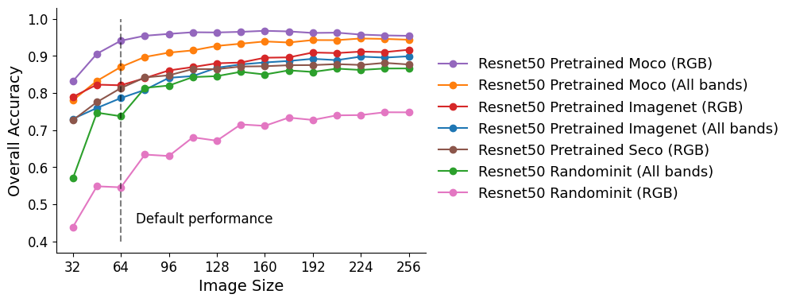
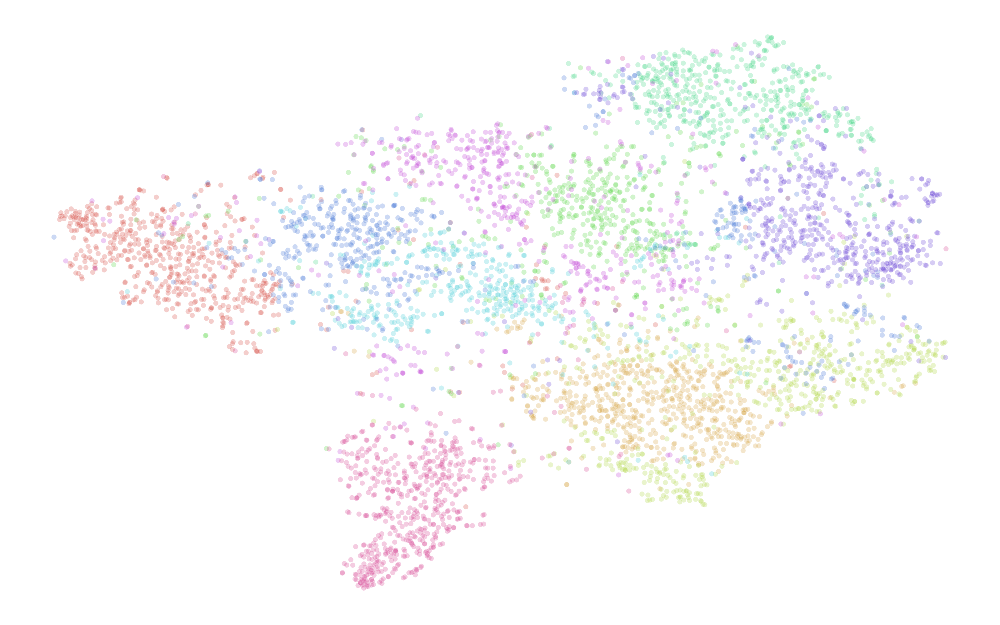
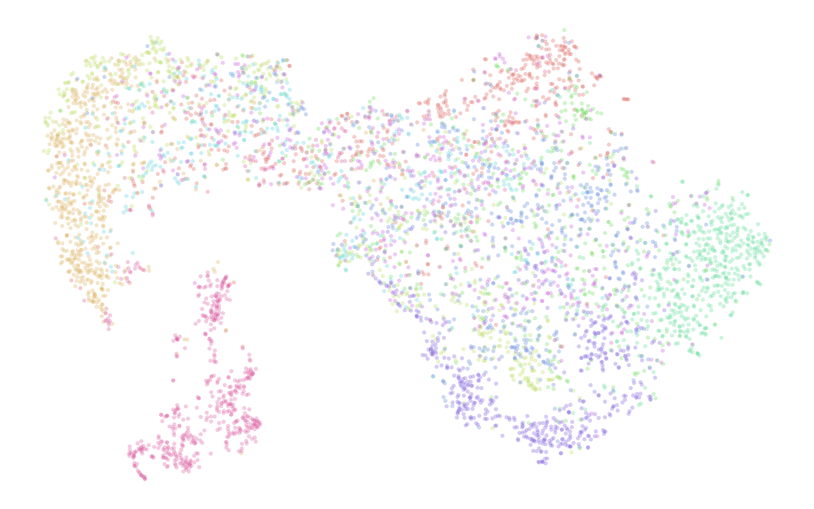
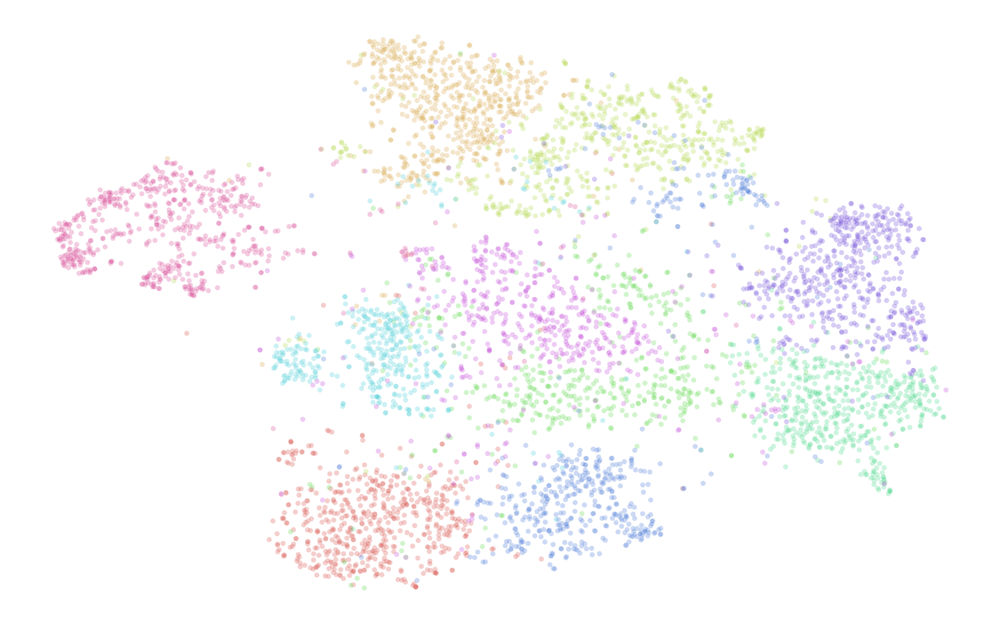

<div align="center">
<h2>Revisiting pre-trained remote sensing model benchmarks: resizing and normalization matters</h2>

[**Isaac Corley**](https://isaacc.dev/)<sup>1</sup> · [**Caleb Robinson**](https://www.microsoft.com/en-us/research/people/davrob/)<sup>2</sup> · [**Rahul Dodhia**](https://www.microsoft.com/en-us/research/people/radodhia/)<sup>2</sup> · [**Juan M. Lavista Ferres**](https://www.microsoft.com/en-us/research/people/jlavista/)<sup>2</sup> · [**Peyman Najafirad (Paul Rad)**](https://scholar.google.com/citations?user=uoCn8c8AAAAJ&hl=en)<sup>1</sup>

<sup>1</sup>University of Texas at San Antonio&emsp;&emsp;&emsp;&emsp;<sup>2</sup>Microsoft AI for Good Research Lab

<a href="[https://arxiv.org/abs/2401.06762](https://arxiv.org/abs/2305.13456)"></a>
</div>

<p align="center">
    <br/>
    <b>Figure 1. Difference in downstream task metrics, Overall Accuracy (OA) (multiclass) or mean Average Precision (mAP) (multilabel), after resizing images to 224 × 224 from the original, smaller, image sizes. ImageNet pretrained models often are trained with 224 x 224 inputs and therefore do not produce useful embeddings with smaller image patches.
</p>


This is the official repository for the paper, ["Revisiting pre-trained remote sensing model
benchmarks: resizing and normalization matters"](https://arxiv.org/abs/2305.13456) presented at the [2024 CVPR PBVS Workshop](https://pbvs-workshop.github.io/).

#### In this paper, we find that by simply resizing and normalizing remote sensing imagery correctly provides a significant boost, particlarly when transferring ImageNet pretrained models to the remote sensing domain

### Resizing

Remote sensing benchmark datasets, e.g. EuroSAT -- 64 x 64, commonly have small image sizes due to patches being extracted from large satellite tiles. However, we find that recently, evaluation is being performed at these small image sizes while being trained at larger image sizes.

<p align="center">
    <br/>
    <b>Figure 2. The effect of input image size on EuroSAT downstream performance (overall accuracy) across different ResNet models.</b> By default, EuroSAT images are 64 × 64 pixels, however resizing to larger image sizes before embedding increases downstream accuracy under a KNN (k = 5)
classification model in all cases.
</p>


### Normalization

Furthermore, we find that many pretrained geospatial foundation models are sensitive to the standard normalization used during inference. Blindly using ImageNet statistics can significantly degrade downgrade representation ability


<p align="center">
  
   
  

<b>Figure 3. t-SNE plots of EuroSAT test set embeddings extracted using a ResNet50 pretrained on ImageNet with different preprocessing.</b> (left to right: 32 × 32 with normalization, 224 × 224 without normalization, 224 × 224 with normalization)
</p>


### Extracting Features

We have provided a sample script for extracting features using various models from the paper from your own folder of remote sensing imagery. Please modify the script to your use case (for best performance you will need the mean/std of your dataset). The extracted features will be saved to `output_directory/model_features.npy`

```bash
python embed.py --model resnet50_pretrained_moco --output-dir outputs --root path/to/your/folder --image-size 224 --batch-size 32 --workers 8 --device cuda:0
```


### Cite

If this work inspired you to properly resize and normalize your images in benchmarking please consider citing our paper

```bibtext
@InProceedings{Corley_2024_CVPR,
    author    = {Corley, Isaac and Robinson, Caleb and Dodhia, Rahul and Ferres, Juan M. Lavista and Najafirad, Peyman},
    title     = {Revisiting Pre-trained Remote Sensing Model Benchmarks: Resizing and Normalization Matters},
    booktitle = {Proceedings of the IEEE/CVF Conference on Computer Vision and Pattern Recognition (CVPR) Workshops},
    month     = {June},
    year      = {2024},
    pages     = {3162-3172}
}
```
